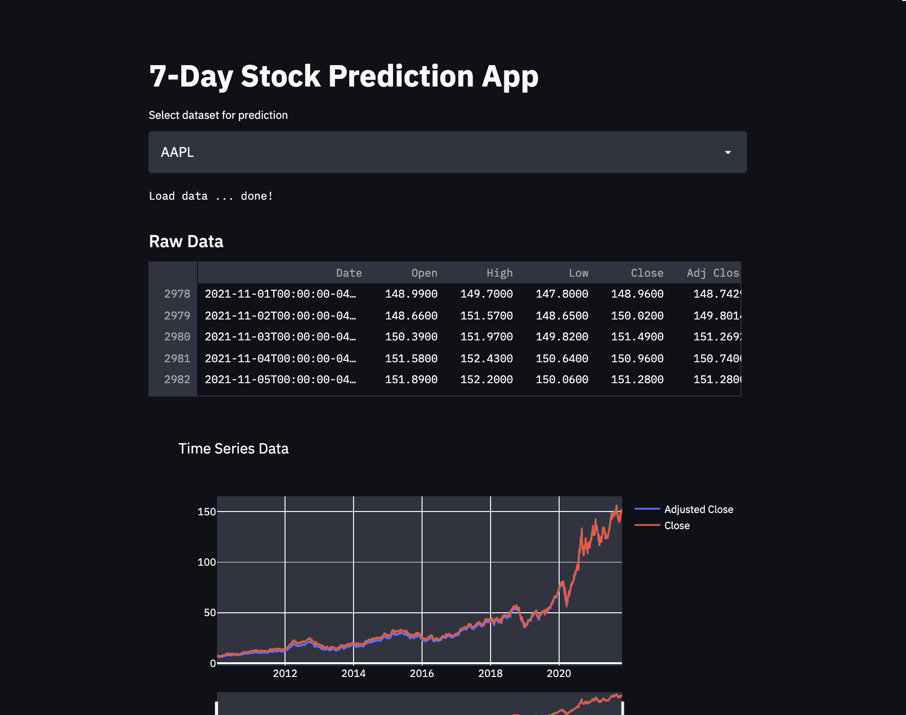
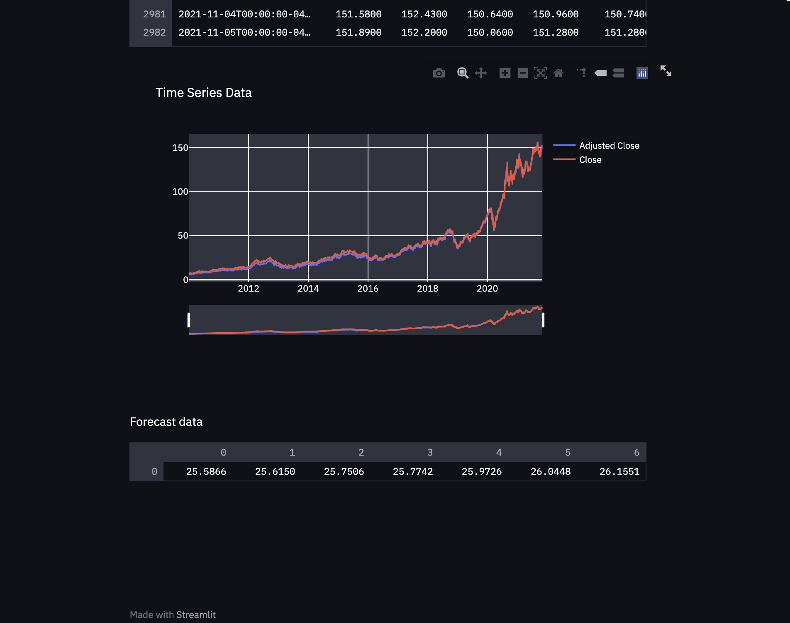

# Stock Price Prediction

## Description
INTRO: Pandemic has changed the way we live, the way we work, and the way we make money. According to Devin Ryan, equity research analyst at JMP Securities, more than 10 million new brokerage accounts were opened by individuals in 2020 — more than ever in a year. Huh, impressive, isn't it? 

DETAILS: So I wannted to see if I can use stock market data to have a meaningful prediction of future prices. I decided to compare the performance of multiple ML models and see how close I can get. I also decided to explore a new to me framework called Streamlit for building simple web-apps. 

## Results:
Among the 5 final models (Linear, Dense, CNN, RNN single-shot, and RNN autoregressive) CNN seems to be the best one. The main problem with this project is that market behaved unexpectedly during the pandemic. We have seen a huge drop in prices followed by a huge spike. Any of the models were unable to predict or adjust to such drastic changes.


## Ideas to improve the performance of the models:
1. Engineer features from news headlines;
2. Engineer fetures from twitter/reddit data;

---

### Instructions to run the app:

1. Install dependencies in your virtual environment by running:

   `conda create -n myenv --file package-list.txt`

2. Run the following command in the root directory to run your web app.
   `streamlit app/run.py`

3. Go to http://localhost:8501/

## Web application screenshots:




#### This folder is orgarnized as follows.

```
CAPESTONE-FINANCE/
├── lib/
├── data/
   |__process-data.ipynb
├── models/
   |__train_predictor.ipynb
   |__conv_model
      |__saved_model.ipynb
├── img/
└── app/
   |__run.py
   |__WindowGenerator.py
|__README.md
|__package-list.txt
|__Writeup.pdf              <- Project Writeup
```

---

## Licensing and Acknowledgements:

The dataset was provided by downloaded from Yahoo Finance - https://finance.yahoo.com
